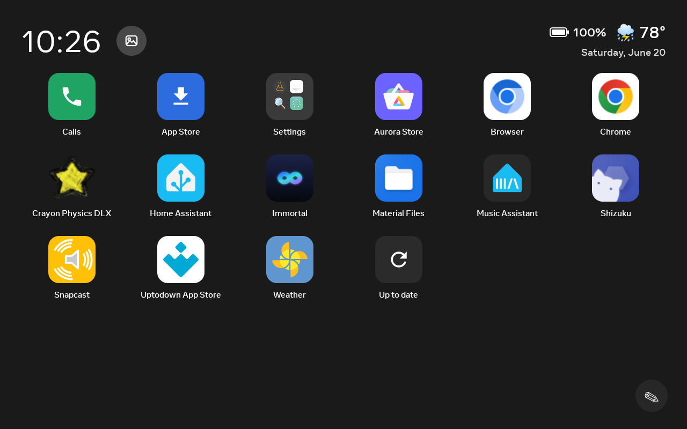

# Launcher

`HomeActivity` — the home screen that replaces the Portal's stock launcher.

A fullscreen app grid with a clock/date/weather header and an optional charge indicator
(shown only on the Portal Go, which has a battery). It's designed for a landscape touchscreen
and is fully navigable by remote on the [Portal TV](portal-tv.md).

## The grid

- **App grid** — your installed apps, fullscreen.
- **Folders** — in Manage mode, drag one app onto another and **hold it there for a second**: the
  app underneath outlines in white to show it's ready, and releasing makes a folder. Passing
  straight over an app without pausing just reorders the grid instead. Name folders, rename them,
  and drag apps back out, just like a phone.
- **Manage mode** — remove apps (tap the ✕) and organise the grid.

## Header

- **Clock / date / weather** — weather is keyless (Open-Meteo + IP geolocation). If the
  detected location is wrong, pin it manually under **Settings → Weather location**
  (city search, also keyless).
- **Now-playing mini-player** — a compact cover-art + play/pause control that appears whenever
  something is playing on the device, sourced from the device's own media session
  (`NowPlayingHub`). It stays out of the way when nothing's playing. See
  [Multi-room audio & now-playing](multi-room-audio.md).
- **App switcher** — a top-bar control (`AppSwitcherActivity`) that lists your recently-used
  apps so you can hop between them without returning to the grid.
- **"hey" voice button** — an optional mic button for push-to-talk to your voice assistant. It
  appears only when the companion wake-word app is explicitly enabled and installed, and is
  supported on **first-gen Portals only** — see [Alexa & voice](../guides/voice-alexa.md).

## Tiles

- **Screensaver** button (top-left) — jump straight into the [photo frame](screensaver.md).
- **Manage** button (bottom-right) — enter Manage mode.
- **Calls** tile — a green tile that bridges to the stock dialer/contacts for WhatsApp and
  Messenger calling.
- **Tools** tile — opens the [Tools](tools.md) screen: cameras, timers, notes, a converter, a
  reading lamp, an intercom, and more.
- **Help** tile — a friendly, non-technical [walkthrough](#help-tour).

Countdown events you add in [Tools → Countdowns](tools.md) also appear on the grid as chips
(`🎂 Birthday · 12 days`).

## Wallpaper

The background behind the grid is a wallpaper mode you pick in Settings (`WallpaperConfig`):

- **Dark** (default) and a set of **gradient** presets.
- **Bundled photos**.
- **Sky** — a full-screen gradient driven by the real sunrise/sunset for your location: dawn pinks,
  midday blue, dusk orange, and a near-black night, refreshed through the day.
- **Star field** — the actual night sky for your latitude and longitude and the current time
  (~60 of the brightest stars, with the lines of Orion, the Big Dipper, and Cassiopeia), fading in
  through twilight.
- **Screensaver** — use your chosen [screensaver](screensaver.md) as the wallpaper too.

## Sounds & input

- **Touch sounds** — an optional soft click on taps, toggled under **More features** in Settings.
  (For chimes and spoken time, see [Ambient & sound](ambient-sound.md).)
- **Back gesture** — an optional accessibility service (`ImmortalBackGestureService`) that adds a
  system-wide "go back" action in any app, and routes a back-to-home to *Immortal's* home rather
  than the Portal's stock launcher. Enable it from **More features → Back gesture** in Settings,
  which opens Android's Accessibility screen where you switch the Immortal service on.

## Settings

`ImmortalSettingsActivity` is the on-device Settings screen, and every Immortal feature is reachable
from it — the screensaver and clock, [sounds and the wake-light](ambient-sound.md), the welcome
overlay, wallpaper, [almanac packs](screensaver.md#ambient-almanac-calendar-packs), touch sounds,
and the back gesture. Each setting is rendered from a single declarative registry, so the same
control appears here and on the [phone remote](remote.md), and can never quietly drift out of sync.

## Help tour

`HelpActivity` is a friendly, non-technical walkthrough shown on a Help tile (and once on first
launch), so anyone can pick up a revived Portal without instructions.
